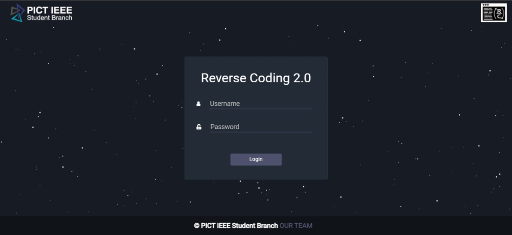
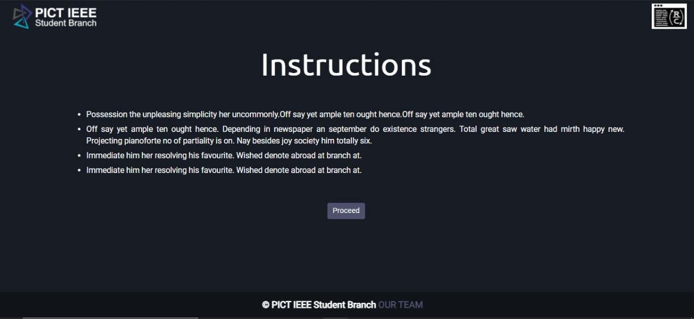
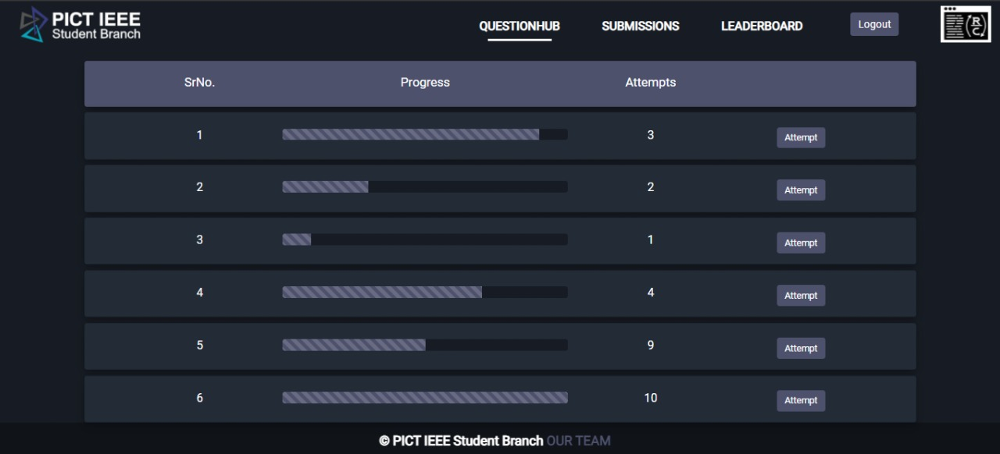
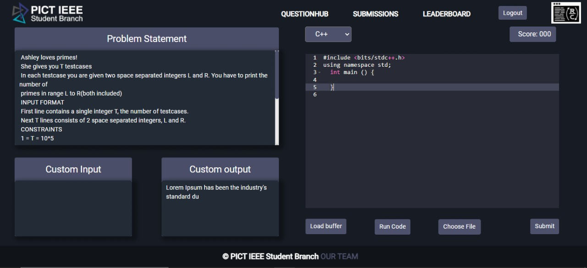
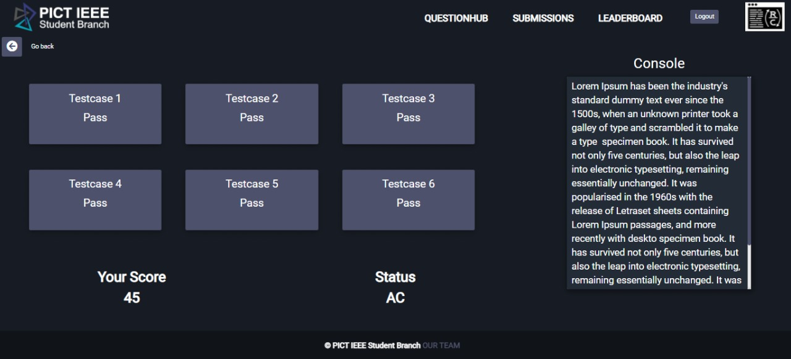
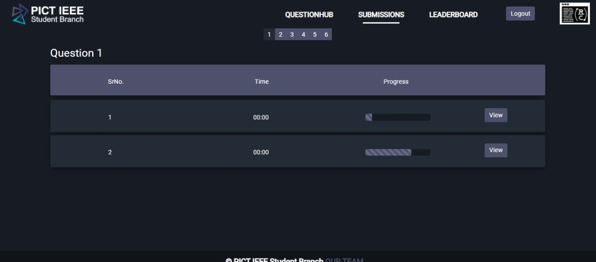
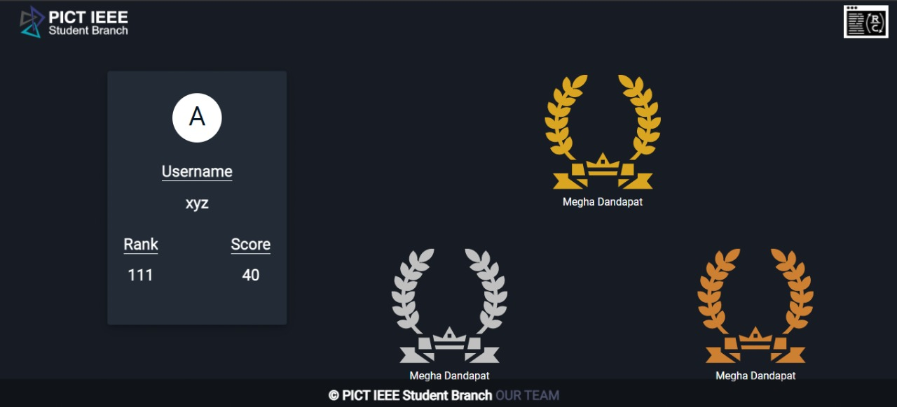

# Reverse Coding 2.0 

## User Interface of the platform:
#### 1) Login

### 2) Instructions

### 3) Question Hub

### 4) Coding

### 5) Testcase

### 6) Submissions

### 7) Leaderboard

### 8) Result

